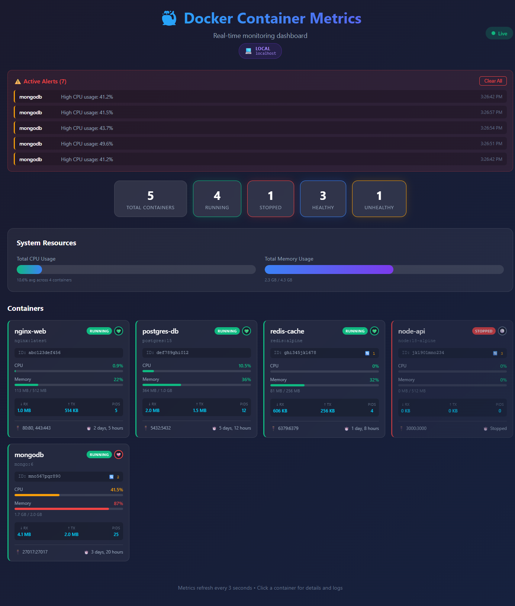
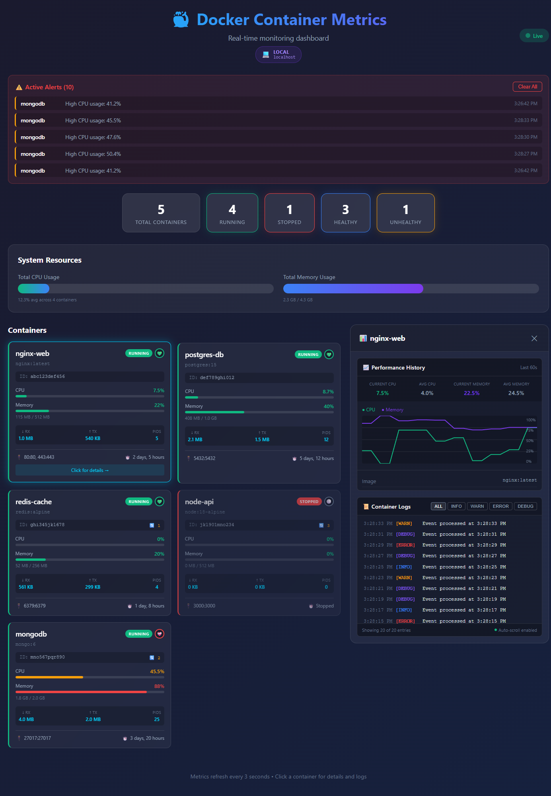
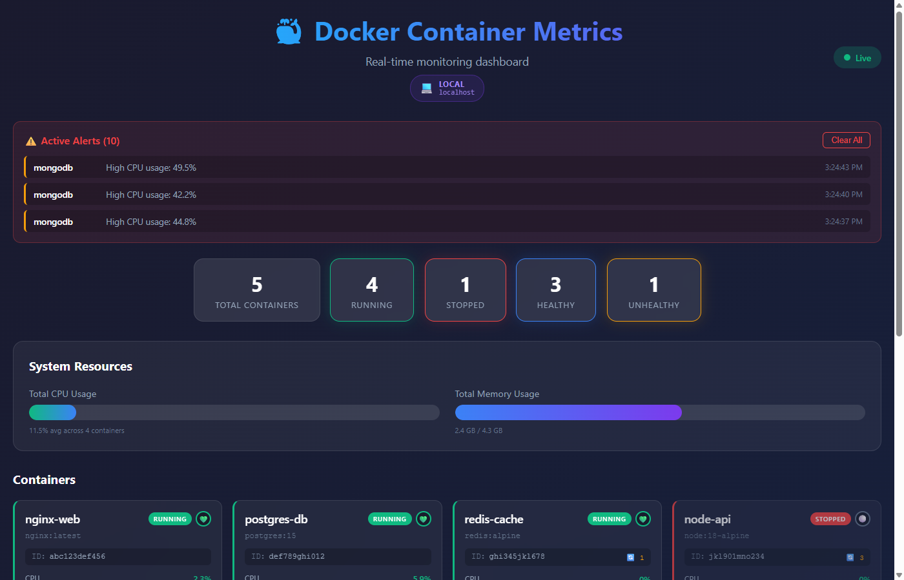

# 🐳 Docker Container Metrics Dashboard

A real-time React dashboard for monitoring Docker container metrics, logs, and resource usage — built to demonstrate [Docker Offload](https://docs.docker.com/offload/) capabilities.

> **Featured in:** *Getting Started with Docker Offload: building a real front-end application* — a Docker blog post by [Naga Santhosh Reddy Vootukuri](https://github.com/siri-varma) & Siri Varma Vegiraju.

---

## ✨ Features

- 📊 **Real-time metrics** — CPU, memory, network I/O, disk, and PIDs per container, refreshed every 3 seconds
- 🚨 **Alerts banner** — automatic alerts when CPU > 40% or memory > 80%
- 📈 **Performance history charts** — rolling 20-point CPU & memory trend graphs per container
- 📋 **Live log viewer** — filterable by INFO / WARN / ERROR / DEBUG with auto-scroll
- 🏷️ **Runtime environment badge** — shows whether the app is running locally or inside Docker, including the real container hostname and platform
- 🎨 **Dark UI** — responsive grid layout built with plain React + CSS

---

## 📸 Screenshots

### Full Dashboard — running on Docker

*Real-time container metrics grid with alerts banner and system resource overview*

### Container Detail — Performance charts & live logs

*Click any container card to expand its performance history chart and live log stream*

### Runtime Environment Badge

*The badge in the header tells you exactly where the app is running — **💻 LOCAL · localhost** when running via `npm start`, or **🐳 DOCKER · \<hostname\> · Linux/x86_64** when running inside a container*

---

## 🗂 Project Structure

```
docker-metrics-ux/
├── Dockerfile              # Multi-stage build: node:18-alpine → nginx:alpine
├── entrypoint.sh           # Injects runtime hostname at container start
├── nginx.conf              # SPA routing + gzip + security headers
├── package.json
├── public/
│   └── index.html          # Loads /runtime-config.js at startup
└── src/
    ├── App.js              # Main component — state, mock data, layout
    ├── App.css             # Global dark-theme styles
    └── components/
        ├── ContainerCard.js / .css   # Per-container metric card
        ├── MetricsChart.js / .css    # CPU & memory sparkline chart
        └── LogViewer.js / .css       # Filterable log stream panel
```

### Key files explained

| File | Purpose |
|---|---|
| `Dockerfile` | Two-stage build: Stage 1 installs deps and builds the React app with `node:18-alpine`; Stage 2 copies the `build/` output into `nginx:alpine` |
| `entrypoint.sh` | Shell script that runs at container startup, writing `window.__RUNTIME_CONFIG__` with the real hostname and platform into `runtime-config.js` before nginx starts |
| `nginx.conf` | Configures nginx to serve the SPA (with `try_files` for React Router), enables gzip, caches static assets for 1 year, and sets security headers |
| `App.js` | Holds mock container data, simulates live metric fluctuation via `setInterval`, manages selected container state, and renders the full layout |
| `ContainerCard.js` | Renders a single container's health, CPU/memory progress bars, network stats, ports, and uptime |
| `MetricsChart.js` | Draws a canvas-based rolling line chart for CPU and memory history |
| `LogViewer.js` | Displays a live scrolling log panel with level-based colour coding and filter buttons |

---

## 🚀 Running Locally (npm)

```bash
git clone https://github.com/siri-varma/docker-metrics-ux
cd docker-metrics-ux
npm install
npm start
```

Open [http://localhost:3000](http://localhost:3000). The header badge will show **💻 LOCAL · localhost**.

---

## 🐳 Running in Docker (local)

```bash
# Build the image
docker build -t docker-metrics-ux .

# Run detached on port 3000
docker run -d -p 3000:80 --name docker-metrics-ux docker-metrics-ux
```

Open [http://localhost:3000](http://localhost:3000). The header badge will show **🐳 DOCKER · \<container-id\> · Linux/x86_64**.

To stop:
```bash
docker stop docker-metrics-ux && docker rm docker-metrics-ux
```

---

## ☁️ Running with Docker Offload

Docker Offload lets you run container workloads on a more powerful remote cloud machine while keeping the same local `docker` CLI experience. It works by creating a secure SSH tunnel to a Docker daemon running in the cloud.

### Prerequisites

- Docker Desktop **4.50 or later**
- Signed in to an account with Docker Offload enabled ([sign up here](https://www.docker.com/products/docker-offload/))

### Steps

**1. Enable Docker Offload**

Either toggle it on in Docker Desktop (the UI turns purple), or run:

```bash
docker offload start
```

The CLI will prompt you to choose your account and whether you need GPU support. Once enabled, a new context called `docker-cloud` is created.

**2. Build & run (same commands — now executing in the cloud)**

```bash
docker build -t docker-metrics-ux .
docker run -d -p 3000:80 --name docker-metrics-ux docker-metrics-ux
```

Even though the commands look identical, the build and the container are running on a remote Linux machine in the cloud.

**3. Open the app**

[http://localhost:3000](http://localhost:3000)

The header badge now shows the **remote machine's hostname and architecture** — this is how you can visually confirm Docker Offload is active:

| Running mode | Badge |
|---|---|
| `npm start` | 💻 LOCAL · localhost |
| `docker run` (local Desktop) | 🐳 DOCKER · `desktop-hostname` · Linux/x86_64 |
| `docker run` (Docker Offload) | 🐳 DOCKER · `cloud-hostname` · Linux/aarch64 |

**4. Stop Docker Offload**

```bash
docker offload stop
# Switch back to local context
docker context use desktop-linux
```

---

## ⚙️ How the Runtime Badge Works

The `REACT_APP_RUNTIME_ENV` approach (build-time env vars) only tells you *how the image was built*, not *where it's running*. Instead, this app uses a runtime injection pattern:

1. `entrypoint.sh` runs when the container starts (before nginx)
2. It calls `hostname` and `uname` — getting the **actual machine's** hostname and CPU architecture
3. It writes these into `/usr/share/nginx/html/runtime-config.js` as `window.__RUNTIME_CONFIG__`
4. `public/index.html` loads this script before React boots
5. `App.js` reads `window.__RUNTIME_CONFIG__` — if present, it knows it's in Docker and shows the real hostname; if absent (local `npm start`), it shows LOCAL

---

## 🏆 Advantages of Docker Offload

- **No expensive local hardware** — run resource-intensive builds and containers in the cloud from a standard laptop
- **Shared infrastructure** — team members use the same cloud environment, eliminating "works on my machine" issues
- **Automatic cleanup** — Docker Offload cleans up cloud resources after a configured idle timeout, preventing runaway cloud costs

---

## 📚 Resources

- [Docker Offload Documentation](https://docs.docker.com/offload/)
- [Docker Desktop Download](https://www.docker.com/products/docker-desktop/)
- [Sign up for Docker Offload](https://www.docker.com/products/docker-offload/)
